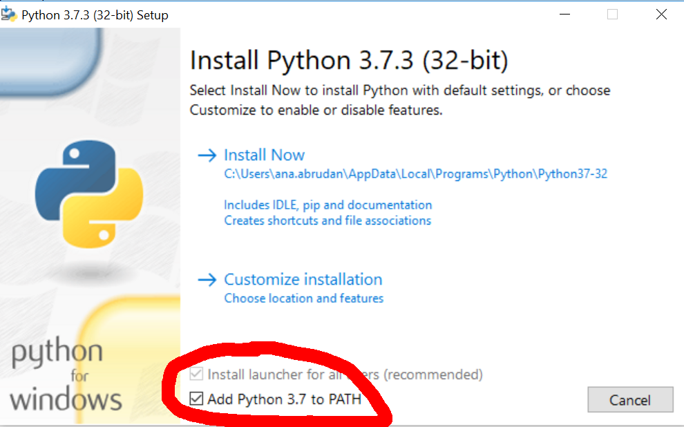

# Intro to Jupyter notebooks

_Data COP 11/07/2019_

## Table of Contents

- [Intro to Jupyter notebooks](#intro-to-jupyter-notebooks)
  - [Table of Contents](#table-of-contents)
  - [Mac users](#mac-users)
    - [Local setup](#local-setup)
    - [Run Jupyter](#run-jupyter)
  - [Windows users](#windows-users)
    - [Local setup](#local-setup-1)
    - [Run Jupyter](#run-jupyter-1)
  - [Running from Docker (optional)](#running-from-docker-optional)

<a name="mac-users"></a>
## Mac users

<a name="local-setup"></a>
### Local setup

Clone this repository. Navigate to where all your `git` things are, and:

```
git clone ssh://git@bitbucket.kobaltmusic.com:7999/data/intro-to-jupyter-notebooks.git
```

Check for Python & `pip`:

```
python --version
pip3 --version
```

Install `virtualenv`:

```
pip3 install virtualenv
virtualenv --version
```

Navigate to your project folder (here!), and set up a virtual environment for Python 3.

```
cd intro-to-jupyter-notebooks
python3 -m virtualenv venv3
```

Activate the environment:

```
source venv3/bin/activate
```

Install any non-core Python packages you will use:

```
pip install jupyter pandas seaborn [things] # space-delimited list of multiple packages
```

View the installed packages:

```
pip list
```

Save the dependencies for your project:

```
pip freeze > requirements.txt
```

To exit the environment:

```
deactivate
```

To use your record of dependencies for you yourself to reproduce this environment elsewhere, or for someone else to easily do this when they run your work:

```
source venv3/bin/activate
pip install -r requirements.txt
```

<a name="run-jupyter"></a>
### Run Jupyter

```bash
source venv3/bin/activate
jupyter notebook
```

Jupyter should launch in your browser at http://localhost:8888/.

<a name="windows-users"></a>
## Windows users

<a name="local-setup-1"></a>
### Local setup

Clone this repository. Navigate to where all your `git` things are, and:
```
git clone ssh://git@bitbucket.kobaltmusic.com:7999/data/intro-to-jupyter-notebooks.git
```

If you haven't installed Python before, first install Python 3.7 from [the official website](https://www.python.org/downloads/). Use default installation and don't forget to **add Python to your PATH**.



Check for Python & `pip`:

```bash
python --version
pip3 --version
```

Install `virtualenv`:

```bash
pip3 install virtualenv
virtualenv --version
```

Navigate to your project folder (here!), and set up a virtual environment for Python 3.

```bash
cd intro-to-jupyter-notebooks
python -m virtualenv venv3
```

Activate the environment:

```bash
venv3\Scripts\activate
```

Install any non-core Python packages (`jupyter` and `pandas`) you will use (space-delimited list of multiple packages):

```bash
pip install jupyter pandas seaborn plotly
```

View the installed packages:

```bash
pip list
```

Save the dependencies for your project:

```bash
pip freeze > requirements.txt
```

Exit the environment:

```bash
deactivate
```

To use your record of dependencies for you yourself to reproduce this environment elsewhere, or for someone else to easily do this when they run your work:

```bash
venv3\Scripts\activate
pip install -r requirements.txt
```

<a name="run-jupyter-1"></a>
### Run Jupyter

```bash
venv3\Scripts\activate
jupyter notebook
```

Jupyter should launch in your browser at http://localhost:8888/.

<a name="running-from-docker--optional"></a>
## Running from Docker (optional)

Docker is another (safer and convenient) way to run Jupyter notebooks. Jupyter provides [official Docker stacks](https://github.com/jupyter/docker-stacks), which are easy to work with and extend. You can install Docker by following the [official instructions](https://docs.docker.com/install/).

As an example, we have extended *jupyter/scipy-notebook* in a Dockerfile, which enables some additional Jupyter plug-ins, and allows us to access to our virtual cloud (via boto3) and SAX (via cx_oracle).

First, we have to build the image:

```bash
docker build . -t ktech-jupyter:1.0.0
```

Assuming you are already [signed in to AWS via Okta](https://k-tech.atlassian.net/wiki/spaces/WEBP/pages/836239361/How+to+sign+in+to+AWS+via+Okta), run the image using the command below:

```bash
saml2aws exec "docker run -e AWS_SECRET_ACCESS_KEY -e AWS_ACCESS_KEY_ID -e AWS_SESSION_TOKEN -e AWS_SECURITY_TOKEN -v \"$PWD\":/home/jovyan/work -p 8888:8888 ktech-jupyter:1.0.0"
```

Make sure that your AWS credentials are up-to-date. In terminal you will see the instructions on how to access Jupyter, i.e. by copying and pasting the URL, `http://127.0.0.1:8888/?token=<generated_token>`, to your browser. The token is generated randomly each time you run the docker container, so don't forget to paste the latest token from the terminal.
